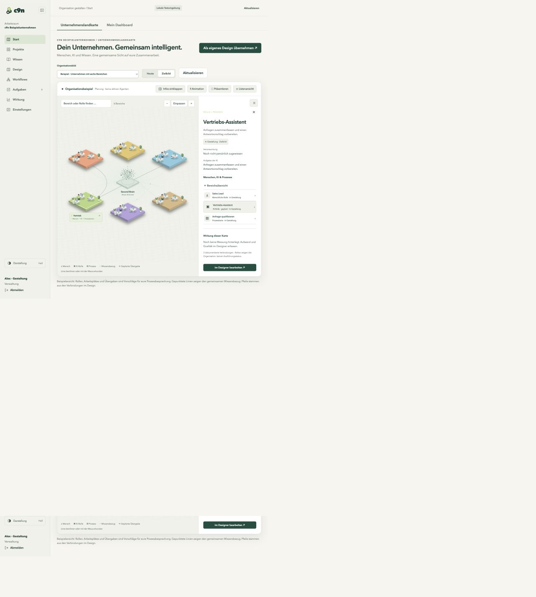

# Wirkivo

### Design how people and AI work together. Prove what improves.

Wirkivo helps teams turn an AI ambition into a shared operating model: map responsibilities, build workflows, review results and measure the effect on everyday work.

**[Explore the product](https://dajor.github.io/wirkivo/en.html) · [Request a guided pilot](docs/PILOT.md) · [Deutsch](README.de.md) · [Join the discussion](https://github.com/dajor/wirkivo/discussions)**

*Actual local prototype, September 2026. The six departments are an editable example; the pictured agents are planned roles, not running workers.*

## Start with the work your team wants to improve

A team wants faster answers. But who owns the reply? What information may the AI use? Who checks an exception? And does it actually reduce effort?

Wirkivo connects those questions in one journey:

1. **Design the organisation.** Discuss today's process and the intended collaboration between people and AI. Explore departments, roles and handovers in a visual company map or editable process canvas.
2. **Make the work repeatable.** Build automations in Standard or Advanced workflow editors. Choose supported providers and models per AI step, and put human review where it belongs.
3. **Keep knowledge useful.** Capture notes, text PDFs and excerpts. Organise sources, review suggestions and turn approved knowledge into follow-up work.
4. **Measure the change.** Record effort, review work and quality with their sources and time periods. Distinguish real observations from test data and targets.

## See the product

| Company design | Workflows | Personal dashboard |
| --- | --- | --- |
| Explore people, AI roles, responsibilities and handovers. | Configure the automation and its review steps. | Find knowledge, decisions and your next action. |
| [Company map](docs/assets/company-landscape.png) | [Workflow editor](docs/assets/workflow-editor.png) | [Dashboard](docs/assets/personal-dashboard.png) |

## Three ways to start

- **[Turn ideas into useful knowledge](docs/use-cases/knowledge.md):** capture → organise → review → reuse.
- **[Prepare marketing content with human approval](docs/use-cases/marketing.md):** brief → draft variants → compare → approve → export.
- **[Design better customer handovers](docs/use-cases/customer-requests.md):** establish responsibilities and evidence before choosing what to automate.

Marketing is one workflow among many. The platform's organising concepts are projects, design, knowledge, workflows and measurable impact.

## What you can evaluate today

| Capability | Current evidence / boundary |
| --- | --- |
| Company landscape and process designer | Local browser checks cover selection, editing, saving, reload, presentation and mobile layout. |
| Login, workspace and personal dashboard | Implemented in the private application; no public hosted trial is currently available. |
| Notes and text PDFs | A bounded knowledge workflow supports capture, review, storage and follow-up tasks. |
| Model connections | Provider adapters and step-level selection exist; availability depends on configuration and supported execution path. |
| Standard / Advanced editors | Available in the prototype. Editing a graph does **not** imply every card or arbitrary graph is executable. |
| Business impact | Source-backed manual measurements are supported. We have not published verified customer savings or ROI. |

[Read the evidence and limitations](docs/EVIDENCE.md) · [See the roadmap](docs/ROADMAP.md)

## A guided pilot, with a clear decision at the end

Pick **one process**, agree on **one accountable owner**, record the baseline, run a supported workflow with human review, and compare the outcome. Decide to continue, change or stop based on the evidence.

**[Request a pilot →](docs/PILOT.md)**

Before a conversation, you can use the [pilot brief](templates/pilot-brief.md) and [measurement worksheet](templates/measurement.csv). They contain no promised savings or pre-filled customer results.

## Build with the community

- [Discussions](https://github.com/dajor/wirkivo/discussions): ask questions, share a non-confidential process or discuss the approach.
- [Issues](https://github.com/dajor/wirkivo/issues/new/choose): report a reproducible problem or describe an improvement.
- [Roadmap](docs/ROADMAP.md): see what is testable, what comes next and what is still open.
- [Releases](https://github.com/dajor/wirkivo/releases): follow documented product updates.

Keep customer details, API keys, prompts containing private data and commercial negotiations out of public issues and discussions. Pilot enquiries have a private contact route.

## Repository scope

This is the **public product and community hub**, including documentation, example blueprints and screenshots. The application source is currently private. This repository is not a self-hostable application release and does not grant an open-source licence for the product or its underlying components.

Wirkivo is the current working product name. [Contributing](CONTRIBUTING.md) · [Content and licence status](NOTICE.md)
